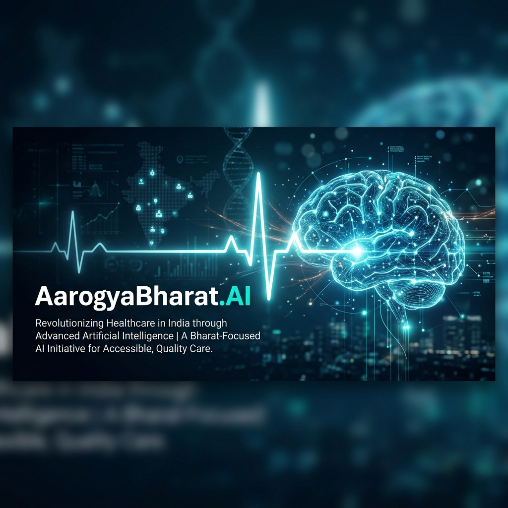
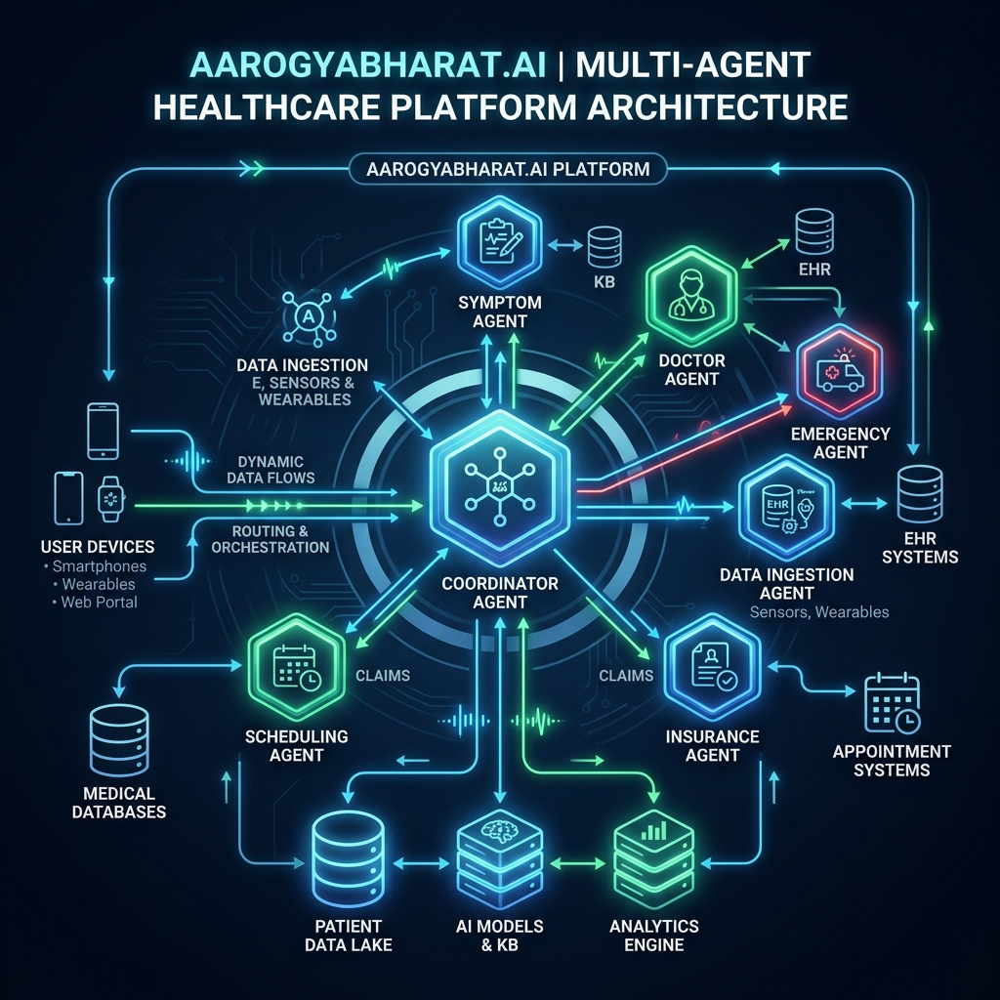

# AarogyaBharat.AI — Intelligent Medical Assistant

AarogyaBharat.AI is a multi-agent medical triage, scheduling, and healthcare management system built using the Agent Development Kit (ADK).

## Prerequisites
- Python 3.11+
- [uv](https://docs.astral.sh/uv/getting-started/installation/) package manager
- Gemini API key ([aistudio.google.com/apikey](https://aistudio.google.com/apikey))

## Quick Start

```bash
git clone <repo-url>
cd aarogya-bharat
cp .env.example .env   # add your GOOGLE_API_KEY
make install
make playground        # opens UI at http://localhost:18081
```

## Architecture



```mermaid
graph TD
    START --> SecurityCheckpoint[Security Checkpoint | PII scrub + injection detect]
    SecurityCheckpoint -- SECURITY_EVENT --> SecurityViolation[Security Violation Handler]
    SecurityCheckpoint -- pass --> CoordinatorAgent[Coordinator Agent | Routing]
    
    CoordinatorAgent --> RouteSelector[Route Selector]
    RouteSelector -- symptom_assessment --> SymptomAgent[Symptom Assessment Agent]
    RouteSelector -- doctor_recommendation --> DoctorAgent[Doctor Recommendation Agent]
    RouteSelector -- appointment_management --> AppointmentAgent[Appointment Management Agent]
    RouteSelector -- medication_management --> MedicationAgent[Medication Management Agent]
    
    SymptomAgent --> DoctorAgent
    
    DoctorAgent --> ResponseFormatter[Response Formatter]
    AppointmentAgent --> ResponseFormatter
    MedicationAgent --> ResponseFormatter
    SecurityViolation --> ResponseFormatter
```

## How to run
- `make playground` → Interactive UI test
- `make run` → Local web server mode

## Sample Test Cases

### 1. Symptom Triage & Doctor Search
**Input:** "I have a severe headache and blurry vision since morning."
**Expected:** The coordinator routes to `symptom_assessment` → outputs triage to `doctor_recommendation` → searches doctors via MCP.
**Check:** The playground UI shows a symptom report indicating urgency and lists recommended neurologists/ophthalmologists.

### 2. Appointment Booking
**Input:** "Book an appointment for Health ID HB-1234 with Dr. Rajesh Kumar on 2026-07-15 at 10:30 AM."
**Expected:** The coordinator routes to `appointment_management` → Agent calls the `book_appointment_slot` MCP tool.
**Check:** The playground UI displays a confirmed appointment booking with the correct ID.

### 3. Medication Schedule
**Input:** "What is my medication schedule? My Health ID is HB-1234."
**Expected:** The coordinator routes to `medication_management` → Agent calls the `get_medication_schedule` MCP tool.
**Check:** The playground UI displays the medication timetable and reminders for the patient.

## Troubleshooting
1. **Server crashes with "no agents found":** Ensure `uv run adk web app` is used instead of wildcard matching.
2. **Duplicate edges error:** The Workflow graph does not allow multiple edges between the same source and target node. This is handled properly in `agent.py` by using unconditional flow to a Response Formatter node.
3. **Changes to code not reflecting (Windows):** Windows hot-reloading for subprocess MCPs may hang. You must manually stop the process using `Get-Process | Stop-Process` and relaunch `make playground`.

## Push to GitHub

1. Create a new repo at https://github.com/new
   - Name: aarogya-bharat
   - Visibility: Public or Private
   - Do NOT initialize with README (you already have one)

2. In your terminal, navigate into your project folder:
   ```bash
   cd aarogya-bharat
   git init
   git add .
   git commit -m "Initial commit: aarogya-bharat ADK agent"
   git branch -M main
   git remote add origin https://github.com/<your-username>/aarogya-bharat.git
   git push -u origin main
   ```

3. Verify `.gitignore` includes:
   ```text
   .env          ← your API key — must NEVER be pushed
   .venv/
   __pycache__/
   *.pyc
   .adk/
   ```

⚠ NEVER push .env to GitHub. Your API key will be exposed publicly.
